# Olá, eu sou André Lucas 👋

### Junior DevOps Engineer • Cloud & Infrastructure • Automation

Construindo uma carreira na interseção entre desenvolvimento, operações e infraestrutura.

[Português](#sobre-mim) • [English](#english-version)

## Sobre mim

Sou formado em **Sistemas de Informação** pelo Centro Metropolitano de Ensino — FAMETRO e tenho experiência como **Desenvolvedor Web** na Secretaria de Estado de Saúde do Amazonas e como **DevOps Engineer Júnior** na Redmaxx Tecnologia.

Atuo como **Junior DevOps Engineer**, com experiência anterior em desenvolvimento web, e venho aprofundando minha atuação em Cloud, infraestrutura, automação e práticas de CI/CD. Busco evoluir continuamente em Infrastructure as Code, Kubernetes, observabilidade e segurança, unindo minha experiência em desenvolvimento à operação de ambientes confiáveis e escaláveis.

- 📍 Manaus, Amazonas, Brasil
- 🚀 Foco profissional em DevOps, Cloud e infraestrutura
- 📚 Aprendizado contínuo em desenvolvimento e operações
- 🤝 Aberto a oportunidades remotas, híbridas ou presenciais

## Tecnologias e ferramentas

### Experiência Prática
#### Tecnologias e ferramentas com as quais já tive contato prático em ambientes profissionais ou projetos, em diferentes níveis de profundidade.

  
  
  
  
  
  
  

### Aprofundando conhecimentos

  
  
  
  
  
  
  

 

#### Também venho aprofundando conhecimentos em Docker, PostgreSQL e Linux, especialmente em administração, segurança, redes, performance e troubleshooting.

## Experiência profissional

- **DevOps Engineer Júnior** — Redmaxx Tecnologia
- **Desenvolvedor Web** — Secretaria de Estado de Saúde do Amazonas

## Formação e desenvolvimento

- **Sistemas de Informação** — Centro Metropolitano de Ensino (FAMETRO), concluído em 2015
- **Formação DevOps** — Prof. Fabrício Veronez
- **Formação Go** — Alura

## Projetos e laboratórios

> 🚧 Novidades em breve.

Esta seção acompanhará minha evolução com projetos e laboratórios práticos desenvolvidos durante minha formação em DevOps. Cada publicação será documentada com seu contexto, arquitetura, ferramentas e aprendizados.

## Estatísticas do GitHub

  
  

## Um pouco além do código

Sou aficionado por tecnologia e tenho um apreço especial por organização. Gosto de projetos bem estruturados, documentados e apresentados, nos quais cada elemento tenha um propósito claro.

> “O conhecimento é o único caminho que sempre avança. Estude para evoluir, aperfeiçoe-se para vencer e nunca olhe para trás, pois o seu futuro está logo à frente.”

## Vamos conversar?

Estou aberto a oportunidades em diferentes modalidades de trabalho. Procuro um ambiente saudável no qual eu possa contribuir, continuar aprendendo e evoluir junto à equipe.

---

## English version

<strong>🇺🇸 Read in English</strong>

### About me

I hold a degree in **Information Systems** from Centro Metropolitano de Ensino — FAMETRO. My professional background includes experience as a **Web Developer** at the Amazonas State Department of Health and as a **Junior DevOps Engineer** at Redmaxx Tecnologia.

My goal is to grow as a **DevOps Engineer** specializing in Cloud and infrastructure. I aim to combine my development background with automation, continuous integration, and infrastructure practices to deliver reliable, organized, high-quality solutions.

- 📍 Based in Manaus, Amazonas, Brazil
- 🚀 Focused on DevOps, Cloud, and infrastructure
- 📚 Continuously learning about development and operations
- 🤝 Open to remote, hybrid, or on-site opportunities

### Professional experience

- **Junior DevOps Engineer** — Redmaxx Tecnologia
- **Web Developer** — Amazonas State Department of Health

### Education and continuous learning

- **Information Systems** — Centro Metropolitano de Ensino (FAMETRO), completed in 2015
- **DevOps Program** — Prof. Fabrício Veronez
- **Go Program** — Alura

### Projects and labs

New practical projects and DevOps labs will be published here as I progress through my learning journey. Each project will include its context, architecture, tools, and key takeaways.

### Let's connect

I am open to remote, hybrid, and on-site opportunities. I am looking for a healthy environment where I can contribute, keep learning, and grow alongside the team.

[Connect with me on LinkedIn](https://www.linkedin.com/in/andrelucasfreitas/)

